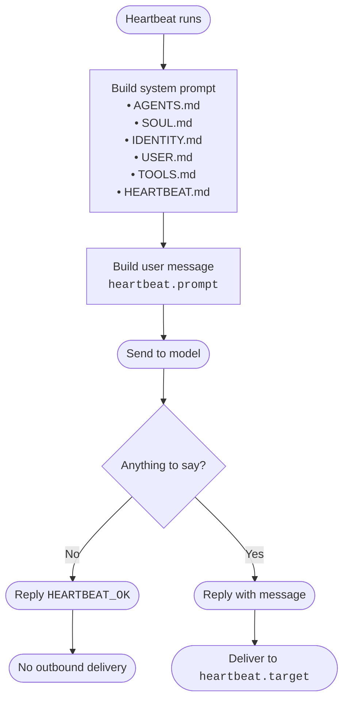

# Heartbeat (Gateway)

Heartbeat runs **periodic agent turns** in the main session so the model can
surface anything that needs attention without spamming you.

## Supported models

Heartbeats use the agent default model unless you override
`agents.defaults.heartbeat.model`. Any provider/model that works for the agent
can be used for heartbeats.

## How heartbeats work

- On each tick, the gateway builds a **system prompt** (same as normal turns)
  and a **heartbeat user message** from `agents.defaults.heartbeat.prompt`.
- If the heartbeat has a delivery target with a session transcript, the last
  10 messages from that target session are **prepended** to the heartbeat user
  message for fresh context.
- The model replies. If there is **nothing to send**, it must reply
  `HEARTBEAT_OK`.
- `HEARTBEAT_OK` is stripped; if the remaining text is **≤ `ackMaxChars`**
  (default: 300), the reply is dropped and nothing is delivered.

### Prompt flow



## How to use heartbeats

1. Leave heartbeats enabled (default is `30m`) or set your own cadence.
2. Create a small `HEARTBEAT.md` checklist in the agent workspace (optional but recommended).
3. Decide where heartbeat messages should go (`target: "last"` is the default).
4. Optional: enable reasoning delivery for transparency.

Example config:

```json5
{
  agents: {
    defaults: {
      heartbeat: {
        every: "30m",
        target: "last",
        // includeReasoning: true, // optional: send separate `Reasoning:` message too
      }
    }
  }
}
```

## Defaults

- Interval: `30m` (set `agents.defaults.heartbeat.every` or per-agent `agents.list[].heartbeat.every`; use `0m` to disable).
- Prompt body (configurable via `agents.defaults.heartbeat.prompt`):
  `Read HEARTBEAT.md if it exists (workspace context). Follow it strictly. Do not infer or repeat old tasks from prior chats. If nothing needs attention, reply HEARTBEAT_OK.`
- The heartbeat prompt is sent **verbatim** as the user message. The system
  prompt includes a “Heartbeat” section and the run is flagged internally.

## What the heartbeat prompt is for

The default prompt keeps the heartbeat focused and avoids rehashing stale context:
- **Checklist-driven**: read and follow `HEARTBEAT.md` when present.
- **No stale context**: don’t infer or repeat old tasks from prior chats.
- **Silent when idle**: respond with `HEARTBEAT_OK` if nothing needs attention.

If you want a heartbeat to do something specific (e.g. “check Gmail PubSub stats”
or “verify gateway health”), set `agents.defaults.heartbeat.prompt` (or
`agents.list[].heartbeat.prompt`) to a custom body (sent verbatim).

## Response contract

- If nothing needs attention, reply with **`HEARTBEAT_OK`**.
- During heartbeat runs, Clawdbot treats `HEARTBEAT_OK` as an ack when it appears
  at the **start or end** of the reply. The token is stripped and the reply is
  dropped if the remaining content is **≤ `ackMaxChars`** (default: 300).
- If `HEARTBEAT_OK` appears in the **middle** of a reply, it is not treated
  specially.
- For alerts, **do not** include `HEARTBEAT_OK`; return only the alert text.

Outside heartbeats, stray `HEARTBEAT_OK` at the start/end of a message is stripped
and logged; a message that is only `HEARTBEAT_OK` is dropped.

## Configuration

```json5
{
  agents: {
    defaults: {
      heartbeat: {
        every: "30m",           // default: 30m (0m disables)
        model: "anthropic/claude-opus-4-5",
        includeReasoning: false, // default: false (deliver separate Reasoning: message when available)
        target: "last",         // last | whatsapp | telegram | discord | slack | signal | imessage | none
        to: "+15551234567",     // optional channel-specific override
        prompt: "Read HEARTBEAT.md if it exists (workspace context). Follow it strictly. Do not infer or repeat old tasks from prior chats. If nothing needs attention, reply HEARTBEAT_OK.",
        ackMaxChars: 300         // max chars allowed after HEARTBEAT_OK
      }
    }
  }
}
```

### Per-agent heartbeats

If any `agents.list[]` entry includes a `heartbeat` block, **only those agents**
run heartbeats. The per-agent block merges on top of `agents.defaults.heartbeat`
(so you can set shared defaults once and override per agent).

Example: two agents, only the second agent runs heartbeats.

```json5
{
  agents: {
    defaults: {
      heartbeat: {
        every: "30m",
        target: "last"
      }
    },
    list: [
      { id: "main", default: true },
      {
        id: "ops",
        heartbeat: {
          every: "1h",
          target: "whatsapp",
          to: "+15551234567",
          prompt: "Read HEARTBEAT.md if it exists (workspace context). Follow it strictly. Do not infer or repeat old tasks from prior chats. If nothing needs attention, reply HEARTBEAT_OK."
        }
      }
    ]
  }
}
```

### Field notes

- `every`: heartbeat interval (duration string; default unit = minutes).
- `model`: optional model override for heartbeat runs (`provider/model`).
- `includeReasoning`: when enabled, also deliver the separate `Reasoning:` message when available (same shape as `/reasoning on`).
- `target`:
  - `last` (default): deliver to the last used external channel.
  - explicit channel: `whatsapp` / `telegram` / `discord` / `slack` / `signal` / `imessage`.
  - `none`: run the heartbeat but **do not deliver** externally.
- `to`: optional recipient override (E.164 for WhatsApp, chat id for Telegram, etc.).
- `prompt`: overrides the default prompt body (not merged).
- `ackMaxChars`: max chars allowed after `HEARTBEAT_OK` before delivery. This guards
  against small, unintended extra text when the model meant a no-op ack.

## Runtime behavior

- Heartbeats run in each agent’s **main session** (`agent:<id>:<mainKey>`), or `global`
  when `session.scope = "global"`.
- If the main queue is busy, the heartbeat is skipped and retried later.
- If `target` resolves to no external destination, the run still happens but no
  outbound message is sent.
- Heartbeat-only replies do **not** keep the session alive; the last `updatedAt`
  is restored so idle expiry behaves normally.

## HEARTBEAT.md (optional)

If a `HEARTBEAT.md` file exists in the workspace, the default prompt tells the
agent to read it. The model will only act on it if your heartbeat prompt
explicitly says to read/follow it. Think of it as your “heartbeat checklist”:
small, stable, and safe to include every 30 minutes.

Tip: if you add a checklist but keep the default prompt, make sure it still
clearly instructs the model to act on the checklist items.

Keep it tiny (short checklist or reminders) to avoid prompt bloat.

Example `HEARTBEAT.md`:

```md
# Heartbeat checklist

- Quick scan: anything urgent in inboxes?
- If it’s daytime, do a lightweight check-in if nothing else is pending.
- If a task is blocked, write down *what is missing* and ask Peter next time.
```

### Can the agent update HEARTBEAT.md?

Yes — if you ask it to.

`HEARTBEAT.md` is just a normal file in the agent workspace, so you can tell the
agent (in a normal chat) something like:
- “Update `HEARTBEAT.md` to add a daily calendar check.”
- “Rewrite `HEARTBEAT.md` so it’s shorter and focused on inbox follow-ups.”

If you want this to happen proactively, you can also include an explicit line in
your heartbeat prompt like: “If the checklist becomes stale, update HEARTBEAT.md
with a better one.”

Safety note: don’t put secrets (API keys, phone numbers, private tokens) into
`HEARTBEAT.md` — it becomes part of the prompt context.

## Manual wake and system events

You can enqueue a system event and trigger an immediate heartbeat with:

```bash
clawdbot wake --text "Check for urgent follow-ups" --mode now
```

If multiple agents have `heartbeat` configured, a manual wake runs each of those
agent heartbeats immediately.

Use `--mode next-heartbeat` to wait for the next scheduled tick.

When using `--mode next-heartbeat`, the text is queued as a **system event** for
the main session and **drained on the next heartbeat**. The queue keeps up to
20 events (older ones drop) and consecutive duplicates are ignored.

### System events (heartbeat context)

System events are short, human-readable context lines that get **prepended** to
the next main-session prompt (including heartbeats). They are ephemeral (in
memory only) and are cleared after being delivered. This is how multiple webhook
signals can be batched into a single heartbeat run.

## Reasoning delivery (optional)

By default, heartbeats deliver only the final “answer” payload.

If you want transparency, enable:
- `agents.defaults.heartbeat.includeReasoning: true`

When enabled, heartbeats will also deliver a separate message prefixed
`Reasoning:` (same shape as `/reasoning on`). This can be useful when the agent
is managing multiple sessions/codexes and you want to see why it decided to ping
you — but it can also leak more internal detail than you want. Prefer keeping it
off in group chats.

## Best practices

- Keep `HEARTBEAT.md` short, stable, and action-oriented.
- If you need a very specific action, set a custom `heartbeat.prompt` and keep it
  explicit about reading `HEARTBEAT.md`.
- Use `target: "none"` if you want heartbeats to update internal state without
  sending messages.
- Prefer longer intervals for low-priority check-ins to control cost.

## Cost awareness

Heartbeats run full agent turns. Shorter intervals burn more tokens. Keep
`HEARTBEAT.md` small and consider a cheaper `model` or `target: "none"` if you
only want internal state updates.
